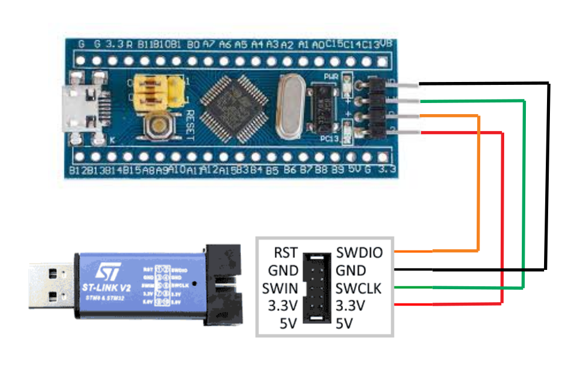

# Instalação da toolchain do STLINK-V2

**Este procedimento completo deve ser realizado sem que o STLINK-V2 esteja conectado na USB. Conecte apenas quando for solicitado pelo tutorial**

Este é um tutorial de instalação do toolchain executado em um ubuntu 20.04.2 LTS. Para instalar o toolchain em outras distribuições linux. MAs deve funcionar de maneira igual ou semelhante para outras distros. Já no windows... não sei.

Para fazer a instalação do STLINK-V2 é necessario ter as seguintes bibliotecas instaladas:

```bash
sudo apt-get install libusb-1.0-0-dev
sudo apt-get install build-essential
```
Posteriormente clonar o repositorio do STLINK-V2 e compilar o mesmo:

```bash
cd $HOME
git clone https://github.com/stlink-org/stlink
cd stlink
cmake .
make 
```

Então movemos os binarios compilados para a pasta /usr/local/bin

```bash
sudo cp $HOME/stlink/bin/* /usr/local/bin
sudo cp $HOME/stlink/lib/*.so* /lib32

sudo mkdir /usr/local/share/stlink
sudo cp -r $HOME/config/chips/ /usr/local/share/stlink
```

Adicionamos as permissoes em udev para o STLINK-V2 e recarregamos as regras

```bash
sudo cp $HOME/stlink/config/udev/rules.d/49-stlinkv* /etc/udev/rules.d/
sudo udevadm control --reload-rules
```

Para testar o STLINK-V2, conecte o mesmo na USB, **sem conectar a bluepill** e execute o comando:

```bash
st-info --probe
```

O resultado deve ser algo parecido com:

```bash
Failed to enter SWD mode
Found 1 stlink programmers
  version:    V2J39S7
  serial:     6068FF286068FF286068FF28
  flash:      0 (pagesize: 0)
  sram:       0
  chipid:     0x000
  dev-type:   unknown
```

A falha em entrar no modo SWD é normal, pois o STLINK-V2 não está conectado na bluepill. Para testar a conexão com a bluepill.
Agora desconecte o STLINK-V2 da USB e conecte a bluepill nele seguindo o diagrama abaixo:



E execute então o seguinte comando para verificar se a blue pill esta se cominucando com o STLINK-V2:

```bash
st-info --probe
```

O resultado deve ser algo parecido com:

```bash
Found 1 stlink programmers
  version:    V2J39S7
  serial:     6068FF286068FF286068FF28
  flash:      32768 (pagesize: 1024)
  sram:       10240
  chipid:     0x412
  dev-type:   STM32F1xx_LD
```

Onde o chipid é o identificador do microcontrolador da bluepill, no caso o STM32F103C8T6.
Isso significa que o STLINK-V2 está se comunicando com a bluepill e ela esta pronta para o uso.


## Exemplos de uso da toolchain

### Lendo um binario da bluepill
    
```bash
st-flash read ./saved.bin 0x8000000 0x1000
```

O comando acima lê 0x1000 bytes a partir do endereço 0x8000000 e salva em um arquivo chamado saved.bin

Para verificar se o arquivo foi salvo corretamente, execute o comando:

```bash
    hexdump -C saved.bin
```

A flag -C faz com que o hexdump mostre os caracteres ASCII ao lado dos hexadecimais.

### Gravando um binario na bluepill

```bash
st-flash write ./saved.bin 0x8000000
```

A operação restaura o binario salvo no exemplo anterior para a bluepill.


### Referências:

- [Embarcados](https://embarcados.com.br/blue-pill-stm32f103c8t6/)
- [Freeelectron](https://freeelectron.ro/installing-st-link-v2-to-flash-stm32-targets-on-linux/)
